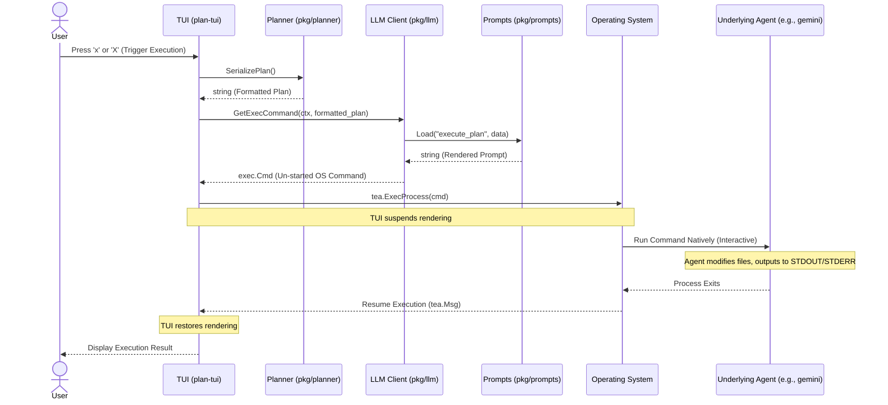

# Execution Workflow

While **planner** is primarily focused on the recursive decomposition of tasks (Planning Mode), it also provides a bridge to actually execute the generated plan. This is known as **Execution Mode**.

Execution Mode works by serializing the current task tree into a flat representation and passing it to an underlying, execution-capable agent (such as the Gemini CLI, GitHub Copilot CLI, or an Opencode agent) natively in the terminal.

## Sequence Diagram

## How It Works

1. **Triggering Execution:** The user initiates execution from the TUI while in the Planning state (`statePlanning`) by pressing the `x` or `X` key.
2. **Serialization:** The TUI requests a string representation of the current task tree from the core orchestrator using `Planner.SerializePlan()`. This converts the nested tree of nodes (with their statuses) into an indented text format.
3. **Command Preparation:** The serialized plan is passed to the active LLM client's `GetExecCommand` method.
   - The client loads the `execute_plan` prompt template from the `pkg/prompts` package, injecting the serialized plan.
   - The client constructs an un-started `exec.Cmd` tailored to its specific agent CLI tool (e.g., `gemini <prompt>`).
4. **Native Execution:** The TUI leverages Bubble Tea's `tea.ExecProcess` function. This temporarily suspends the TUI, clears the screen, and runs the generated `exec.Cmd` natively attached to the user's terminal. This allows interactive tools to prompt the user or stream output directly to standard out without TUI interference.
5. **Resumption:** Once the underlying agent process exits, the operating system returns control to the TUI. The TUI resumes rendering and displays an execution summary view (`stateExecuting`), indicating success or displaying any captured errors.
